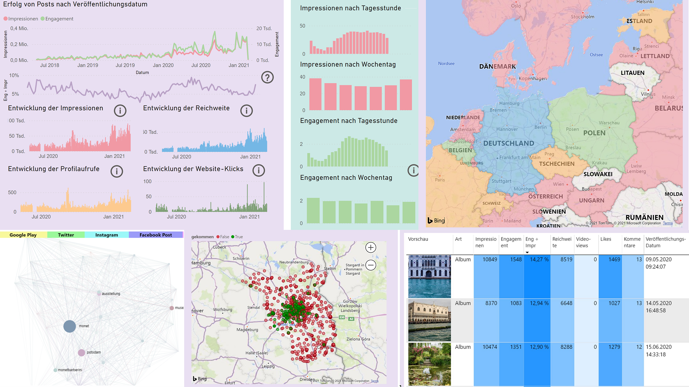

# Barberini Analytics

[](https://www.slideshare.net/ChristophThiede2/barberini-analytics-system-architecture-242783873)
[](https://youtu.be/Z8s3fdrzI7c?t=5965)
[](https://hpi.de/fileadmin/user_upload/hpi/veranstaltungen/2020/Bachelorpodium_2020/Pressemitteilung_BP_2020_Bachelorprojekte/Pressemitteilung_BP2020_Pressemitteilung_FN1_V2.pdf)

A suite of data mining, analytics, and visualization solutions to create an awesome dashboard for the Museum Barberini, Potsdam, in order to help them analyze and assess customer, advertising, and social media data!

This solution has been originally developed in part of a Data Analytics project run as a cooperation of the Museum Barberini (MB) and the Hasso Plattner Institute (HPI) in 2019/20 (see [Credits](#credits) below).
The project comprises a data mining pipeline that is regularly run on a server and feeds several visualization dashboards that are hosted in a Power BI app.
For more information, see also the following resources:

- [System architecture slides](https://www.slideshare.net/ChristophThiede2/barberini-analytics-system-architecture-242783873)
- [Original project description (organizational)](https://www.slideshare.net/ChristophThiede2/barberini-analytics-optimierung-der-kommunikations-und-marketingstrategie-auf-grundlage-von-datenbasierten-insights) (German)
- [Original project description (technical)](https://hpi.de/fileadmin/user_upload/hpi/dokumente/studiendokumente/bachelor/bachelorprojekte/2019_20/FG_Naumann_BP_Barberini_2019-20.pdf) (German)
- [Final press release](https://hpi.de/fileadmin/user_upload/hpi/veranstaltungen/2020/Bachelorpodium_2020/Pressemitteilung_BP_2020_Bachelorprojekte/Pressemitteilung_BP2020_Pressemitteilung_FN1_V2.pdf) (German)
- [Official presentation video](https://www.tele-task.de/lecture/video/8266/#t=5961) ([mirror on YouTube](https://youtu.be/Z8s3fdrzI7c?t=5965))



## Note regarding reuse for other projects

While this solution has been tailored for the individual needs of the MB and the overall project is characterized by the structure of a majestic monolith, we think that it contains some features and components that have great potential for being reused as part of other solutions.
In particular, these features include the following highlights:

- **Gomus binding:** Connectors and scrapers for accessing various data sources from the museum management system _go~mus_.
  See [`src/gomus`](./src/gomus) and the relevant [documentation](DOCUMENTATION.md#data-sources).
- **Apple App Store Reviews binding:** Scraper for fetching all user reviews about an app in the Apple App Store.
  See [`src/apple_appstore`](./src/apple_appstore.py) and the relevant [documentation](DOCUMENTATION.md#data-sources).
- **Visitor Prediction:** Machine-Learning (ML) based solution to predict the future number of museum visitors by extrapolating historic visitor data.
  See [`src/visitor_prediction`](./src/visitor_prediction).
  
  Credits go to Georg Tennigkeit ([@georgt99](https://github.com/georgt99)).
- **Postal Code Cleansing:** Collection of heuristics to correct address information entered by humans with errors.
  See [`src/_utils/cleanse_data.py`].
  
  Credits go to Laura Holz ([@lauraholz](https://github.com/lauraholz)).
- **Power BI Crash Tests:** Load & crash tests for Power BI visualization reports.
  See <https://github.com/LinqLover/pbi-crash-tests>.
  
  Credits go to Christoph Thiede ([@LinqLover](https://github.com/LinqLover)).

Development is currently being continued on [GitLab](https://gitlab.com/Museum-Barberini/Barberini-Analytics) (private repo) but a [mirror of the repository is available on GitHub](https://github.com/Museum-Barberini/Barberini-Analytics).

If you are interested in reusing any part of our solution and have further questions, ideas, or bug reports, please do not hesitate to contact us!

## Backend

### Installation

#### Requirements

- UNIX system

Please note that these instructions are optimized for Ubuntu/amd64.
If you use a different configuration, you may need to adjust the toolchain installation (see `install_toolchain.sh`).

#### Actual installation

1. Clone the repository using git

   ```bash
   git clone https://github.com/Museum-Barberini/Barberini-Analytics.git
   ```

   * For best convenience, clone it into `/root/bp-barberini`.

2. Copy the `secrets` folders (which is not part of the repository) into `/etc/barberini-analytics`.
   From the `secret_files` subdirectory, you may omit files denoted as caches in the [documentation](./DOCUMENTATION.md#secrets).

3. Set up the toolchain.
   See `scripts/setup/install_toolchain.sh` how to do this.
   If you use ubuntu/amd64, you can run the script directly.
   Use `sudo` to run the commands!

4. Set up the docker network and add the current user to the `docker` user group.
   Do **not** run this script with `sudo`!

   ```bash
   ./scripts/setup/setup_docker.sh
   ```

5. Make sure to set the timezone of the machine to match the timezone of the gomus server.

   ```bash
    sudo timedatectl set-timezone Europe/Berlin
    ```

#### Database

##### TLS encryption

To use TLS encryption, we recommend using Let's Encrypt and certbot.
Installation:

```bash
./scripts/setup/setup_letsencrypt.sh
```

Alternatively, just make sure that in `/var/barberini-analytics/db-data`, the following files are present and up to date:

- `server.crt`
- `server.key`

See [configuration](./CONFIGURATION.md#tls-encryption) for more information.

##### Start the database

```bash
mkdir -p /var/barberini-analytics/db-data
make startup-db
```

##### Set up the database

###### Option 1: Initial setup

Run `scripts/setup/setup_db.sh`.
This has not been tested for a long time!

###### Option 2: Restore from backup

```bash
ssh -C <oldremote> "docker exec barberini_analytics_db pg_dump -U postgres -C barberini | bzip2" | bunzip2 | docker exec -i barberini_analytics_db psql -U postgres
scp <oldremote>:/var/barberini-analytics/db-data/applied_migrations.txt /var/barberini-analytics/db-data/
./scripts/setup/setup_db_config.sh
```

##### Schedule regular DB updates

Run `sudo scripts/setup/setup_cron.sh`.
If you cloned the repository in a different folder than `/root/bp-barberini`, you may want to adapt the paths in `scripts/setup/.crontab` first.
If no crontab exists before, create it using `crontab -e`.

#### GitLab CI Runner

These instructions assume that you want to use a custom GitLab CI runner:

1. Go to the GitLab CI/CD settings of your repository (e.g., <https://gitlab.com/Museum-Barberini/Barberini-Analytics/-/settings/ci_cd#js-runners-settings>), locate <kbd>New project runner</kbd>~~, and choose <kbd>Show runner instalation and registration instructions</kbd> from the menu~~.
   ~~Follow the instructions.~~  
   Follow [these instructions](https://docs.gitlab.com/runner/install/linux-repository.html#installing-gitlab-runner) instead to install the runner via apt with an update path. See <https://gitlab.com/gitlab-org/gitlab/-/issues/424394> for the inconsistency in the docs.

   **Configuration:**

   - To set up a new runner, use these options:
     - executor type: `shell`
   - To reuse the config of an existing runner, you may need to somehow cancel this dialog and reuse your existing `/etc/gitlab-runner/config.toml` file instead.
   
   Check whether the runner is displayed in the GitLab CI/CD settings.

2. Add the gitlab-runner user to the docker group:

   ```bash
   sudo usermod -aG docker gitlab-runner
   ```

3. Fix shell profile loading: Check whether `/home/gitlab-runner/.bash_logout` tries to clear the console, and if so, comment out the respective line.
   See <https://docs.gitlab.com/runner/shells/index.html#shell-profile-loading> for more information.

4. Customize the runner config (`/etc/gitlab-runner/config.toml`) depending on your needs.
   This is what we use:

   ```diff
   -concurrent = 1
   +concurrent = 2
   # ...
   [[runners]]
   +  # WORKAROUND for permission issues. See: https://gitlab.com/gitlab-org/gitlab-runner/-/issues/2221
   +  # NOTE: Update the string to match the runner user's password. This requires the user to be in the sudo group.
   +  pre_clone_script = "echo <password_here> | sudo -S chown -f gitlab-runner:gitlab-runner -R /home/gitlab-runner/builds"
   ```

5. Trigger a pipeline run to check whether the runner works.

#### Configuration

See [`CONFIGURATION.md`](CONFIGURATION.md).

#### Development

Run `scripts/setup/setup_dev.sh` to set up the development environment.

### Usage

##### Accessing the docker containers

Have a look at our beautiful `Makefile`!
To access the luigi docker, do:

```bash
make startup connect
```

Close the session by executing:

```bash
make shutdown
```

#### Controlling the pipeline

##### Open the luigi webinterface

```bash
make docker-do do='make luigi-scheduler'
```

This will also start a webserver on <http://localhost:8082> where you can trace all running tasks.

##### Running the pipeline manually

```bash
make docker-do do='make luigi'
```

Or, if you want to run a specific task:

`make connect`:

```bash
make luigi-task LTASK=<task> LMODULE=<module> [LARGS=<task_args>] [MINIMAL=True]
```

If you see this error:

> To modify production database manually, set BARBERINI_ANALYTICS_CONTEXT to the PRODUCTION constant.

Then you want either to set the `BARBERINI_ANALYTICS_CONTEXT` environment variable to `PRODUCTION` or to run the task against a test database:

```bash
export POSTGRES_DB=barberini_test
```

### Running the tests

`make connect`:

```bash
$ make test
```

### Running the minimal mining pipeline

```bash
./scripts/tests/run_minimal_mining_pipeline.sh
```

## Frontend (Power BI)

### Installation

#### Requirements

- Windows 10

#### Actual Installation

Download and install Power BI: <https://powerbi.microsoft.com/downloads>

## Complete documentation

See [`DOCUMENTATION.md`](DOCUMENTATION.md).

## Maintenance

See [`MAINTENANCE.md`](MAINTENANCE.md).

## Credits

**Authors:** [Laura Holz](https://github.com/lauraholz), Selina Reinhard, [Leon Schmidt](https://github.com/leonschmidt99), [Georg Tennigkeit](https://github.com/georgt99), [Christoph Thiede](https://github.com/LinqLover), [Tom Wollnik](https://github.com/twollnik) (bachelor project BP-FN1 @ HPI, 2019/20).  
**Organizations:** [Hasso Plattner Institute, Potsdam](https://hpi.de/en); [Museum Barberini](https://www.museum-barberini.com/en/); Hasso Plattner Foundation.
